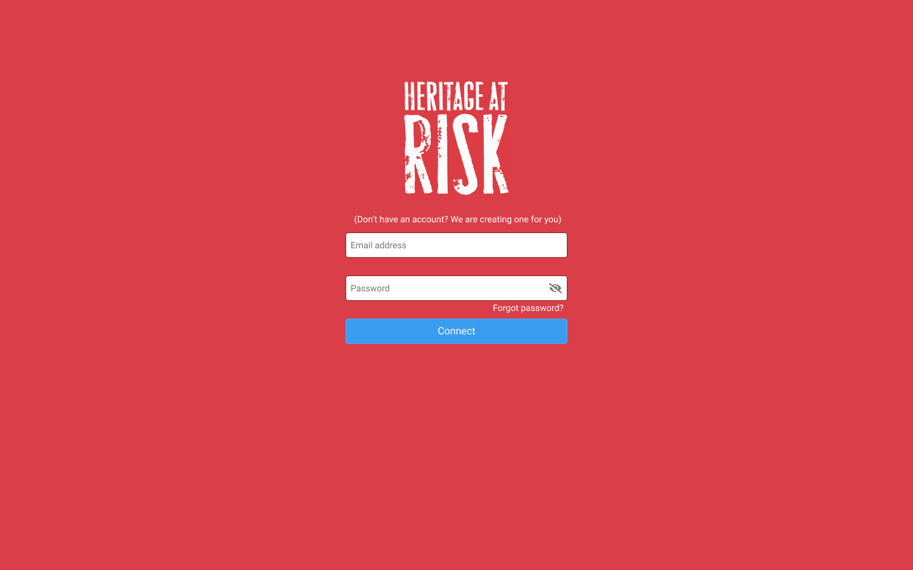

# Heritage at Risk Web Server


Heritage at Risk Web server is a simple web server application that allows heritage lovers to edit heritage at risk reports they have submitted with their mobile phones.

Your mission, should you choose to accept it, is to develop the Heritage at Risk web server application using **Django**.

[Django](https://www.djangoproject.com/) is a Python-based free and open-source [web framework](https://en.wikipedia.org/wiki/Web_framework) that follows the [model-template-view (MTV)](https://en.wikipedia.org/wiki/Model%E2%80%93view%E2%80%93controller) architectural pattern. [Django](https://www.youtube.com/playlist?list=PLEsfXFp6DpzTD1BD1aWNxS2Ep06vIkaeW) takes care of much of the hassle of web development, so you can focus on writing your app without needing to reinvent the wheel. In 2020, Django is one of the [most popular web frameworks](http://hotframeworks.com/).

## Waypoint 1: Initial Setup

Install the most recent version of `django` and create the [project](https://docs.djangoproject.com/en/3.0/glossary/#term-project) `har` with the [command `django-admin startproject`](https://www.youtube.com/watch?v=UmljXZIypDc&list=PL-osiE80TeTtoQCKZ03TU5fNfx2UY6U4p):

```bash
$ django-admin startproject har .
$ ls
Pipfile		Pipfile.lock	har		manage.py
$ tree
.
├── Pipfile
├── Pipfile.lock
├── har
│   ├── __init__.py
│   ├── asgi.py
│   ├── settings.py
│   ├── urls.py
│   └── wsgi.py
└── manage.py

1 directory, 8 files
```

This command generates a collection of settings, including database configuration, Django-specific options and application-specific settings.

You should be able to run the initial default version of your Web server application:

```bash
$ $ python manage.py runserver
Watching for file changes with StatReloader
Performing system checks...

System check identified no issues (0 silenced).

You have 17 unapplied migration(s). Your project may not work properly until you apply the migrations for app(s): admin, auth, contenttypes, sessions.
Run 'python manage.py migrate' to apply them.

May 29, 2020 - 04:05:00
Django version 3.0.6, using settings 'har.settings'
Starting development server at http://127.0.0.1:8000/
Quit the server with CONTROL-C.
```

You can access the homepage of your Web server application at [http://127.0.0.1:8000/](http://127.0.0.1:8000/):


The terminal of your Web server application should display logging/trace information similar to the following:

```bash
[29/May/2020 04:05:31] "GET / HTTP/1.1" 200 16351
[29/May/2020 04:05:32] "GET /static/admin/css/fonts.css HTTP/1.1" 200 423
[29/May/2020 04:05:32] "GET /static/admin/fonts/Roboto-Light-webfont.woff HTTP/1.1" 200 85692
[29/May/2020 04:05:32] "GET /static/admin/fonts/Roboto-Regular-webfont.woff HTTP/1.1" 200 85876
[29/May/2020 04:05:32] "GET /static/admin/fonts/Roboto-Bold-webfont.woff HTTP/1.1" 200 86184
Not Found: /favicon.ico
[29/May/2020 04:05:32] "GET /favicon.ico HTTP/1.1" 404 1969
```

### Administration Page

You can also access the administration page of your Web server application at [http://127.0.0.1:8000/admin](http://127.0.0.1:8000/admin). This is a web interface to create, view, modify and delete data from the database, as well as special operations that are also related to the data.


You may wonder which username and which password to use to connect as an administrator. We will see this later. You can enter whatever username and password you want. You will get an error that indicates that the table `auth_user` is missing:


This is because we haven't generate the initial Django's database. You will need to stop your Web application server and execute the following command:

```bash
$ python manage.py migrate
Operations to perform:
  Apply all migrations: admin, auth, contenttypes, sessions
Running migrations:
  Applying contenttypes.0001_initial... OK
  Applying auth.0001_initial... OK
  Applying admin.0001_initial... OK
  Applying admin.0002_logentry_remove_auto_add... OK
  Applying admin.0003_logentry_add_action_flag_choices... OK
  Applying contenttypes.0002_remove_content_type_name... OK
  Applying auth.0002_alter_permission_name_max_length... OK
  Applying auth.0003_alter_user_email_max_length... OK
  Applying auth.0004_alter_user_username_opts... OK
  Applying auth.0005_alter_user_last_login_null... OK
  Applying auth.0006_require_contenttypes_0002... OK
  Applying auth.0007_alter_validators_add_error_messages... OK
  Applying auth.0008_alter_user_username_max_length... OK
  Applying auth.0009_alter_user_last_name_max_length... OK
  Applying auth.0010_alter_group_name_max_length... OK
  Applying auth.0011_update_proxy_permissions... OK
  Applying sessions.0001_initial... OK
```

By the way, create a Django administrator account with the [command `createsuperuser`](https://docs.djangoproject.com/en/3.0/topics/auth/default/#creating-superusers). For example:

```bash
$ python manage.py createsuperuser
Username (leave blank to use 'dcaune'): daniel.caune
Email address: daniel.caune@intek.edu.vn
Password:
Password (again):
Superuser created successfully.
```

Run again your Web server application and [login with the administrator account](<(http://127.0.0.1:8000/admin)>) you have just created. Here we go!


## Waypoint 2: Create Application `Report`

We have created the initial shell of our Django Heritage at Risk Web server **project** – the _environment_, if you prefer – but it is still almost empty. We need now to create our **application** inside this project.

An application is a Web application that does something – e.g., a Weblog system, a database of public records, or a small poll application. A project is a collection of configuration and applications for a particular website. A project can contain multiple applications. An application can be in multiple projects.

Each application consists of a Python package that follows a certain convention. Django comes with a [utility that automatically generates the basic directory structure of an application](https://docs.djangoproject.com/en/3.0/ref/django-admin/#startapp), so you can focus on writing code rather than creating directories.

Create a Django Web application with the name `report`. For example:

```bash
$ python manage.py startapp report har
$ tree
.
├── Pipfile
├── Pipfile.lock
├── db.sqlite3
├── har
│   ├── __init__.py
│   ├── asgi.py
│   ├── report
│   │   ├── __init__.py
│   │   ├── admin.py
│   │   ├── apps.py
│   │   ├── migrations
│   │   │   └── __init__.py
│   │   ├── models.py
│   │   ├── tests.py
│   │   └── views.py
│   ├── settings.py
│   ├── urls.py
│   └── wsgi.py
└── manage.py
```

They are many ways to [structure a Django project](https://djangobook.com/mdj2-django-structure/). In this mission, we aim to keep each Django application separated/isolated from the others: each Django application is hosted in its own directory structure with all the files related to this application (HTML/CSS, JavaScript, data model, views, routes, etc.). We also put all the Django applications' folders under the Django project's folder.

## Waypoint 3: Create Connection Page Layout

The [login page](https://www.figma.com/file/oxQtQ8IyVBXItI2bX7Cjzk/Intek-Curriculum-Year-1-Heritage-at-Risk-Web-Server?node-id=1%3A2) of our website allows **anonymous users** – users who are not authenticated – to connect to our website and to login providing some **credentials** (an email address and a password). The login page is the first page that anonymous users access to.

### Layout



This page is composed of the [logo](https://reactnative.dev/docs/image) of the application (cf. image file `logo_har.2.0.png`) and a [form](https://developer.mozilla.org/en-US/docs/Web/HTML/Element/form) that allows the user to enter his credentials.

The form itself is composed of the following components:

- A [text input field](https://developer.mozilla.org/en-US/docs/Web/HTML/Element/input) `Email Address` to allow the user to enter his e-mail address
- A text input field `Password` to allow the user to enter his password
- A clickable eye icon on the rightmost position of the password input field to hide/show the password edited by the user
- A link to allow the user to recover his forgotten password
- A [button `Connect` to submit](https://developer.mozilla.org/en-US/docs/Web/HTML/Element/input/submit) the credentials entered by the user.
- A label informing the user that the website will automatically create an account for the user if the user is not already registered to the platform

### Template

With Django, the module responsible for [rendering the HTML](https://docs.djangoproject.com/en/3.0/topics/http/shortcuts/#render) to be displayed on the browser is by convention `views.py`. A view itself is a Python function which takes a Web request and returns a Web response. This can be more than just a function, and Django provides an example of [some classes](https://docs.djangoproject.com/en/3.0/topics/class-based-views/) which can be used as views.

You generally don't mix Python code and HTML together. You rather prefer to separate the layout of the page in dedicated files and the controller in the Python file `views.py`. [HTML template files](https://www.youtube.com/watch?v=OHRm7dYWlzY&list=PLEsfXFp6DpzTD1BD1aWNxS2Ep06vIkaeW&index=15) are generally stored in a folder `templates`.

_Note: Make sure that the [setting `APP_DIRS`](https://docs.djangoproject.com/en/3.0/topics/templates/#configuration) equals `True`. This setting tells whether the engine should look for templates inside installed applications._

Create the folder `templates` and create a file `connection.html` in this folder:

```bash
$ tree har/report
har/report
├── __init__.py
├── admin.py
├── apps.py
├── migrations
│   └── __init__.py
├── models.py
├── templates
│   └── connection.html
├── tests.py
└── views.py
```

In your module `views.py`, add a function `render_connection_view` that takes an argument `request` (a [`HttpRequest`](https://docs.djangoproject.com/en/3.0/ref/request-response/#django.http.HttpRequest) object) and that returns an [`HttpResponse`](https://docs.djangoproject.com/en/3.0/ref/request-response/#django.http.HttpResponse) object with the result of the [rendered template](https://docs.djangoproject.com/en/3.0/intro/tutorial03/#a-shortcut-render) of your file `connection.html`.

### Static Files

Websites generally need to serve additional files such as images, JavaScript, or CSS. In Django, these files are referred as **static files**.

Django static files can be in [many places](https://docs.djangoproject.com/en/3.0/ref/settings/#std:setting-STATICFILES_FINDERS):

- `FileSystemFinder` will look static files in each of [STATICFILES_DIRS](https://docs.djangoproject.com/en/3.0/ref/settings/#std:setting-STATICFILES_DIRS),
- `AppDirectoriesFinder` will look for static files in the `static` subfolder in each of your `INSTALLED_APPS`. This allows libraries like Django Admin to add their own static files to your application.

In the context of this mission, we will store these files under a folder `static` located in our Django application's folder `report`. You need to add the `AppDirectoriesFinder` in the variable `STATICFILES_FINDERS` of the file `settings.py` of your Django project:

```python
STATICFILES_FINDERS = [
    'django.contrib.staticfiles.finders.FileSystemFinder',
    'django.contrib.staticfiles.finders.AppDirectoriesFinder',
]
```

Create the folder `static` and the sub-folders `css`, `img`, and `js`. Add a file `connection.css` in the folder `css`, and add a file `connection.js` in the folder `js`:

```bash
$ tree har/report
har/report
├── __init__.py
├── admin.py
├── apps.py
├── migrations
│   └── __init__.py
├── models.py
├── static
│   ├── css
│   │   └── connection.css
│   ├── img
│   └── js
│       └── connection.js
├── templates
│   └── connection.html
├── tests.py
├── urls.py
└── views.py
```

_Note: Django will use the first static file it finds whose name matches, and if you had a static file with the same name in a different application, Django would be unable to distinguish between them. There are several ways to ensure that Django points at the right one (e.g., [namespacing](https://docs.djangoproject.com/en/3.0/ref/settings/#staticfiles-dirs-prefixes)). This topic is out of the scope of the mission._

You will need to add the tag [``](https://docs.djangoproject.com/en/3.0/ref/templates/builtins/#std:templatetag-static) in your HTML file `connection.html` to be able to reference static files from your HTML file. For example:

```html

<!DOCTYPE html>
<html>
  <head>
    <title>Heritage at Risk</title>
    <link href="" rel="stylesheet" />
    <script src=""></script>
  </head>
  <body></body>
</html>
```

When you connect to the homepage [http://127.0.0.1:8000/](http://127.0.0.1:8000/) of your Web server with your favorite browser, Django should be able to return the static files stored in the sub-folder of the folder `static` of your Django application `report`:

```bash
[02/Jun/2020 03:11:28] "GET / HTTP/1.1" 200 1205
[02/Jun/2020 03:11:28] "GET /static/js/connection.js HTTP/1.1" 200 0
[02/Jun/2020 03:11:28] "GET /static/css/connection.css HTTP/1.1" 200 0
```

### URL Dispatcher

Now, how to instruct Django so that it returns the HTML page when the browser connects to the homepage? This is the role of Django [URL dispatcher](https://docs.djangoproject.com/en/3.0/topics/http/urls/) that maps page URLs with functions responsible for rendering these pages (the views).

The root URL dispatcher is the module `urls.py` located in your Django project folder `har`. You can declare your homepage URL `''` in this module, and map it to your function `render_connection_view`, but it's generally a better practice to create a local module `urls.py` in your Web application and to [include these local modules](https://docs.djangoproject.com/en/3.0/ref/urls/#include) in the root module `urls.py`.

```
$ tree har/report
har/report
├── __init__.py
├── admin.py
├── apps.py
├── migrations
│   └── __init__.py
├── models.py
├── static
├── templates
│   └── connection.html
├── tests.py
├── urls.py
└── views.py
```

Create the local module `urls.py` in your Web application `report`. Include it in the root module `urls.py` of your project `urls.py`. Declare the homepage URL `''` and map it to the function `render_connection_view`.

Open your browser and enter the homepage URL of your Django Web server http://127.0.0.1:8000/. You should face the error `TemplateDoesNotExist` error page:


This is because you have forgotten to declare your Django application `report` in the settings [`INSTALLED_APPS`](https://docs.djangoproject.com/en/3.0/ref/settings/#installed-apps) of your Django project. Add the declaration of your Django application and retry:


## Waypoint 4: Handle Connection Page View

Django comes with a user registration and [authentication system](https://docs.djangoproject.com/en/3.0/topics/auth/). Django provides [User objects](https://docs.djangoproject.com/en/3.0/topics/auth/default/#user-objects) that represent users who connect to the Website (username, password, and some other information).

Django supports the persistence of the information of users in database using an Object Relational Mapping. The advantage of letting Django manage your users is that you can easily control users with the Django administration interface.

Django supports forms to help developers in managing [user registration](https://docs.djangoproject.com/en/3.0/topics/auth/default/#django.contrib.auth.forms.UserCreationForm) and [login authentication](https://docs.djangoproject.com/en/3.0/topics/auth/default/#django.contrib.auth.forms.AuthenticationForm).

Generally [user registration and login authentication](https://www.youtube.com/watch?v=tUqUdu0Sjyc) come with two separate procedures: the user either creates an account (**sign-up**), either logins (**sign-in**). We would like to handle only one procedure: we call it the **connection** procedure. This procedure handles both user creation and login:

1. If the user has not registered an account, the procedure automatically creates an account, providing his username and his password, and the procedure eventually logins the user.
2. If the user has already registered an account, the procedure verifies if the password entered by the user in the login form corresponds to the password that has been stored with the user's account.

_Warning: The default Django user creation requires to provide a field password (`password1`) and a field password confirmation (`password2`). You need to modify the behavior of the class `UserCreationForm` so that the field password confirmation (`password2`) is not required._

Update the function `render_connection_view` to handle the connection procedure. If the user authenticates successfully, the function `render_connection_view` [redirects](https://docs.djangoproject.com/en/3.0/topics/http/shortcuts/#redirect) the user to the url `/report` (that we will complete later). If the authentication of the user fails, the website keeps the user to the connection page (homepage) and displays a message to inform the user that his password doesn't match the username he has entered.

## Waypoint 5: Create Report Model

Our Heritage at Risk website will allow authenticated users to submit new reports of heritages at risk. These reports will be stored in the website's database.

We are not going to directly insert the information of these reports into database using SQL statements. We are going to use the [Object-Relational Mapping of Django](https://www.youtube.com/watch?v=r9kT-jm136Q).

Declare a [Django model](https://docs.djangoproject.com/en/3.0/topics/db/models/) `Report` with the following attributes:

- `name` (string): Name given by the user to his Heritage at Risk report, such as the name of the heritage itself.
- `user` (reference to a user): models.ForeignKey(UserModel, on_delete=CASCADE, null=False)
- `latitude` (decimal): Latitude-angular distance, expressed in decimal degrees (WGS84 datum), measured from the center of the Earth, of a point north or south of the Equator corresponding to the location of the heritage.
- `longitude` (decimal): Longitude-angular distance, expressed in decimal degrees (WGS84 datum), measured from the center of the Earth, of a point east or west of the Prime Meridian corresponding to the geographic location of the heritage.
- `altitude` (decimal): Altitude in meters of the geographic location of the heritage.
- `accuracy` (decimal): Accuracy in meters of the geographic location of the heritage. The value of this attribute is optional.
- `creation_time` (date/time): Date and time when this report has been registered to the server platform. This date and time default to the current timestamp.
- `update_time` (date/time): Date and time of the most recent modification of this report. This date and time default to the current timestamp.

The underlying table has not been created yet in our website database. For that, we need to request Django to [propagate our changes into our database schema](https://docs.djangoproject.com/en/3.0/topics/migrations/). Django basically [detects changes to our model](https://www.youtube.com/watch?v=69YkZqZgz9s) and translates them into SQL statements to migrate accordingly our database schema:

```bash
$ python manage.py makemigrations
Migrations for 'report':
  har/report/migrations/0001_initial.py
    - Create model Report
```

Then we need to request Django to [apply the migration](https://docs.djangoproject.com/en/3.0/ref/django-admin/#django-admin-migrate):

```bash
$ python manage.py migrate
Operations to perform:
  Apply all migrations: admin, auth, contenttypes, report, sessions
Running migrations:
  Applying report.0001_initial... OK
```

We can verify directly with `sqlite3` that the table corresponding to our model `Report` has been created with all the columns:

```bash
$ sqlite3 db.sqlite3
SQLite version 3.28.0 2019-04-15 14:49:49
Enter ".help" for usage hints.

sqlite> .headers ON
sqlite> .mode column

sqlite> .tables
auth_group                  django_admin_log
auth_group_permissions      django_content_type
auth_permission             django_migrations
auth_user                   django_session
auth_user_groups            report_report
auth_user_user_permissions

sqlite> pragma table_info('report_report');
cid         name        type        notnull     dflt_value  pk
----------  ----------  ----------  ----------  ----------  ----------
0           id          integer     1                       1
1           name        text        1                       0
2           latitude    real        1                       0
3           longitude   real        1                       0
4           altitude    real        1                       0
5           accuracy    real        0                       0
6           creation_t  datetime    1                       0
7           update_tim  datetime    1                       0
8           user_id     integer     1                       0

sqlite> .schema report_report
CREATE TABLE IF NOT EXISTS "report_report" ("id" integer NOT NULL PRIMARY KEY AUTOINCREMENT, "name" text NOT NULL, "latitude" real NOT NULL, "longitude" real NOT NULL, "altitude" real NOT NULL, "accuracy" real NULL, "creation_time" datetime NOT NULL, "update_time" datetime NOT NULL, "user_id" integer NOT NULL REFERENCES "auth_user" ("id") DEFERRABLE INITIALLY DEFERRED);
CREATE INDEX "report_report_user_id_97759155" ON "report_report" ("user_id");
```

Developers often wonder whether they need to commit the migration files to their version control system. Quoting from the [Django migrations documentation](https://docs.djangoproject.com/en/3.0/topics/migrations/):

> The migration files for each app live in a `migrations` directory inside of that app, and are designed to be committed to, and distributed as part of, its codebase. You should be making them once on your development machine and then running the same migrations on your colleagues’ machines, your staging machines, and eventually your production machines.

If you follow this process, you shouldn't be getting any merge conflicts in the migration files.

When merging version control branches, you still may encounter a situation where you have multiple migrations based on the same parent migration, e.g. if to different developers introduced a migration concurrently. One way of resolving this situation is to introduce a _merge migration_. Often this can be done automatically with the command:

```bash
$ python manage.py makemigrations --merge
```

which will introduce a new migration that depends on all current head migrations. Of course this only works when there is no conflict between the head migrations, in which case you will have to resolve the problem manually.

## Waypoint 6: Handle Report Creation Page View

We are going to allow authenticated users to create new reports of heritage at risks.

### Report Edition


We are going to display a [form based on our model](https://www.youtube.com/watch?v=6oOHlcHkX2U&list=PLEsfXFp6DpzTD1BD1aWNxS2Ep06vIkaeW&index=24&t=0s) `Report` to allow a user to enter information about an heritage at risk. The input fields are:

- `name`
- `latitude`
- `longitude`
- `altitude`
- `accuracy`

This form will be displayed in a page that the user can access through the URL `/report` with the HTTP `GET` method.

1. Add the `ReportForm` in the file `forms.py` of your application.
2. Add the function `render_report_creation_view` in the file `views.py` of your application.
3. Add the file `report_creation.html` in the folder `template` of your application.
4. Add the URL `report` in the file `urls.py` of your application, and map it to the function `render_report_creation_view`.
5. Finally, update the function `render_report_creation_view` to render the template `report_creation.html` with your form `ReportForm`.

_Note: Don't forget to mention that your function `render_report_creation_view` can only be called if the [user is logged-in](https://docs.djangoproject.com/en/3.0/topics/auth/default/#the-login-required-decorator)._

### Report Submission

The user submits the data he has entered in the form to the same URL `/report` with the HTTP `POST` method. Update the function `render_report_creation_view` to save the data of the form in the database.

_Note: Don't forget to map the authenticated user to the report you are creating, otherwise you will run into a "NOT NULL constraint failure" error._

### Report Administration

To be able to manage users' reports in your Django administration interface, you need to [register your models](https://developer.mozilla.org/en-US/docs/Learn/Server-side/Django/Admin_site). You can click on the model name `Report` to go to the administration page that lists all its associated records, and you can further click on those records to edit them. You can also directly click the Add link next to each model to start creating a record of that type.

| Application Models              |
| ------------------------------- |
|  |

| Application Model Objects       |
| ------------------------------- |
|  |

| Application Model Object Data   |
| ------------------------------- |
|  |

## Waypoint 7: Display and Update a Report

Our users will be able to display and to update any reports they have created by browsing a [URL such as `/report/1`](https://docs.djangoproject.com/en/3.0/topics/http/urls/#example), using the HTTP method `GET`, where `1` corresponds to the identification of a report registered to the website.

### Display an Existing Report


Similar to the view that allows a user to create a report:

1. Add the function `render_report_update_view` in the file `views.py` of your application.
2. Add the file `report_update.html` in the folder `template` of your application.
3. [Add a URL](https://www.youtube.com/watch?v=qmxoGYCFruM) in the file `urls.py` of your application, and map it to the function `render_report_update_view`.
4. Update the function `render_report_update_view` to render the template `report_update.html` with your form `ReportForm` that needs to contain the [data of the report](https://docs.djangoproject.com/en/3.0/topics/db/queries/#retrieving-objects) stored into the website's database.

_Note: Only the user who has created this report is allowed to see the data of this report._

### Update an Existing Report

When the user clicks on the button `Update`, the website needs to store the data of the report that may have been modified in the form.

As you already know, we should use the [HTTP method `PUT`](https://developer.mozilla.org/en-US/docs/Web/HTTP/Methods/PUT) with a URL such as `/report/1`. However according to the [HTML standard](https://www.w3.org/TR/html52/sec-forms.html#form-control-infrastructure-form-submission), [GET and POST are the only HTTP methods](https://docs.djangoproject.com/en/3.0/topics/forms/#get-and-post) to use when dealing with forms. The expression `<form method="put">` is invalid HTML and will be treated like the simple expression `<form>` (i.e., using the default method `get`). Therefore, you must use the form's method `post`.

## Waypoint 8: Display the List of Reports

The main page, when the user is authenticated, is the page that lists the reports that the user has submitted. Users access to this page through the URL `/reports`, using the HTTP method `GET`.


The page displays the list of reports submitted by the user and sorted by their chronological ascending order of submission.

A report is composed of the icon `ic_heritage.svg`, the name of the report, the geographic location of the heritage at risk, and two buttons `Edit` and `Delete`. The icon `Edit` redirects the user to the URL `/report/<id>`. The icon `Delete` redirects the user to the URL `/report/<id>/deletion`.

The button `Add Report` redirects the user to the URL `/report`.

1. Add the function `render_reports_view` in the file `views.py` of your application.
2. Add the file `reports.html` in the folder `template` of your application.
3. Add a URL in the file `urls.py` of your application, and map it to the function `render_reports_view`.

Edit the function `render_reports_view` to [fetch the reports of the user](https://docs.djangoproject.com/en/3.0/topics/db/queries/#retrieving-specific-objects-with-filters). Edit the file `reports.html` to display the [list of reports](https://www.youtube.com/watch?v=Wo9rydYSxxA).

## Waypoint 9: Delete a Report

A user should be able to delete a report he has submitted by browsing a URL such as `/report/1`, using the HTTP method `DELETE`. However, for a similar reason than the one we explained in the previous waypoint, it is not possible to use this HTTP method `DELETE`. We need to use the HTTP method `GET`. Therefore we are going to change the URL with something like `/report/1/deletion`.

1. Add the function `render_report_deletion_view` in the file `views.py` of your application.
2. Add a URL in the file `urls.py` of your application, and map it to the function `render_report_deletion_view`.
3. Update the function `render_report_deletion_view` to redirect the user to the page that displays the list of reports.
